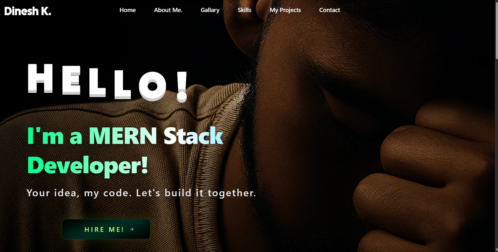

# 🌌 My Portfolio – Dinesh Khichar

A *modern, animated, and responsive portfolio website* built using **React + Vite + Tailwind CSS**.  
Designed to reflect creativity, technical skill, and a futuristic aesthetic — showcasing my **journey as a Fullstack Developer**.



🔗 **Live Demo** → [Click Here](https://dineshportfolios.site/)

---

## ✨ Features

- ⚡ **Blazing fast builds** with Vite  
- 🎨 **Tailwind-powered design** with animations  
- 📱 **Responsive** across all devices  
- 🖼️ Dedicated **Projects showcase** with images/videos  
- 📬 **Hire Me / Contact section** with EmailJS integration  
- 🌙 **Dark + Neon premium theme** for a cinematic feel  

---

## 🧭 Navbar Overview

### 🏠 **Home**
A welcoming **hero section** featuring my name, profession, and tagline.  
Animated backgrounds, smooth transitions, and CTA buttons lead to key sections of the site.

### 🙋‍♂️ **About Me**
Introduces who I am — my passion for web development, learning journey, and goals.  
Includes a short bio with a focus on skills, education, and career aspirations.

### 🖼️ **Gallery**
A vibrant and interactive gallery displaying my creative snapshots, UI mockups, and visual works.  
Adds personality and life to the portfolio with a cinematic dark-neon glow.

### 🧠 **Skills**
Showcases my core technical stack and proficiency.  
Includes languages, frameworks, tools, and libraries such as React, Tailwind, Node.js, MongoDB, and more.

### 💼 **My Projects**
A dedicated section for my professional and personal projects.  
Each project card includes:
- 🧩 Title and short description  
- 🖼️ Image or video preview  
- 🔗 Live Demo & GitHub links  
- ⚙️ Tech stack used  

### 📩 **Contact**
A sleek and functional **contact form** integrated with **EmailJS**, allowing visitors to reach me directly.  
Also includes links to my social profiles for easy networking.

---

## 🛠️ Tech Stack


---

## 🚀 Getting Started

To run this project locally:

```bash
# Clone the repository
git clone https://github.com/dineshkhichar569/My-Portfolio.git

# Navigate to project directory
cd My-Portfolio

# Install dependencies
npm install

# Start the development server
npm run dev


## 🙋‍♂️ Author

**Dinesh Khichar**
Fullstack & DevOps Enthusiast | B.Tech CSE @ DIT University

💼 [LinkedIn](https://linkedin.com/in/dineshkhichar)  
🐙 [GitHub](https://github.com/dineshkhichar569)  
🌐 [Portfolio](https://dineshportfolios.site/)

## 💖 Acknowledgement

Thanks for checking out my portfolio!
If you like it, please ⭐ star this repository and feel free to fork or use it as inspiration.


---

Would you like me to:
- Add **animated or gradient badges** (for a neon-glow look)?  
- Or keep this **clean GitHub markdown style**?  

I can generate either instantly.

